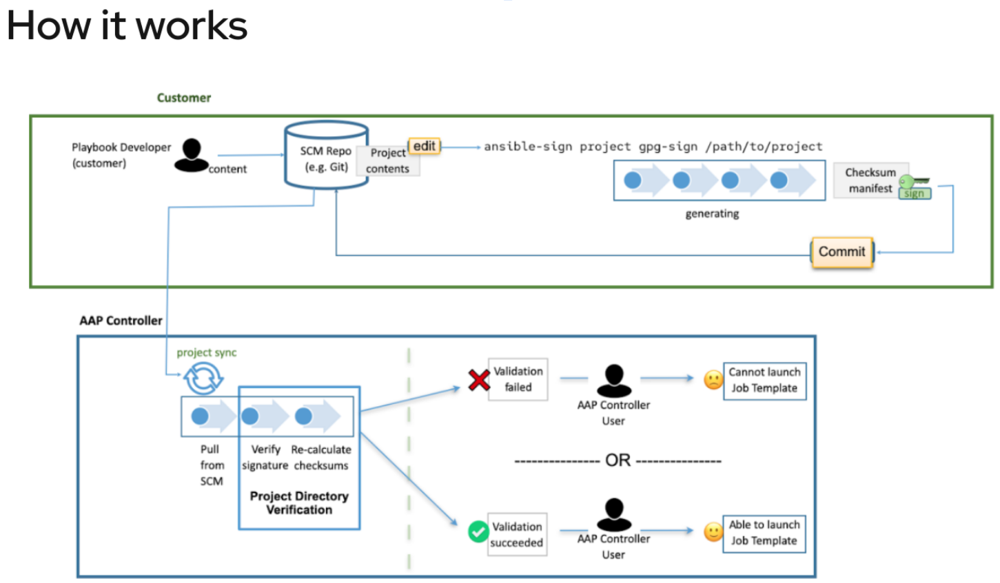

# Isolated use of ansible-sign
* Crontab runs script
* Script validates gpg signature of project
* Script applies automation

## How ansible-sign works with Ansible Automation Platform
Read more here: https://docs.ansible.com/automation-controller/latest/html/userguide/project-sign.html 

